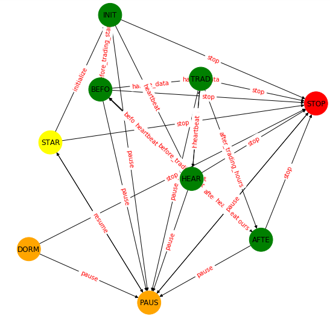

blueshift.algorithm package
===========================

This forms the core of the package. This set of modules implements three
major objectives: 

    * Run the big while loop of the event driven framework.
    * Implement all the API interfaces needed from within the input user algo module/ script. 
    * Run and handle all interaction betweem the user module/ script and rest of the framework (like handling communications, managing errors and logs etc.).

Submodules
----------

algorithm
++++++++++++++++++++++++++++++++++++

.. automodule:: blueshift.algorithm.algorithm
    :members:
    :undoc-members:
    :show-inheritance:

context
++++++++++++++++++++++++++++++++++

Context acts as a placeholder. This fullfills three purposes. This takes away
the concerns of all necessary inputs from the main algorithm. This includes
the broker, data sources, clock, authentication method and other things
necessary to execute the algorithm. This allows the main algo to concentrate
on only managing the event loop and calling apporpriate functions at each 
event. The second purpose is to provide a transparent way to the user to 
interact with algo context and other related machinery behind it. For example
the user script channels all it's query related to any non-data information
to context. This includes querying about portfolio, positions, broker details
calendar etc. (Data related query is transparently handled by `data_portal` 
object). The final utility is to provide a namespace to the user to store 
any user variable required. It can simply be added and accessed as an 
attribute to the context.

The API entry functions makes the current context available to the user 
script. Usually this is passed as the first argument `context`.

.. autoclass:: AlgoContext
    :members: name, broker, account, orders, open_orders, portfolio, performance, trading_calendar, pnls, timestamp, recored_vars
    :undoc-members:
    :show-inheritance:

.. seealso:: Blueshift API functions.

state\_machine
+++++++++++++++++++++++++++++++++++++++++

This module implements the state machine for a trading algorithm. This is
based on a complete set of possible states and a allowed transition matrix.
The possible states are superposition of algo state with respect to the 
trading clock as well as user interaction.

The allowed states are:

    *  STARTUP: This is when the algorithm run comes in to existance.
    * INITIALIZED: This is after the algorithm is `initialized`, i.e. the `initialize` method starts execution.
    * BEFORE_TRADING_START: This is when the `before_trading_start` method starts execution.
    * TRADING_BAR: This is during the usual trading hours.
    * AFTER_TRADING_HOURS: When the `after_trading_hours` method starts execution.
    * HEARTBEAT: The state during `heartbeat` (non-market hours).
    * PAUSED: The algo is issued a `pause` command.
    * STOPPED: The algo is stopped.
    * DORMANT: An extra state for future use.
    
Below image shows the state transition diagram between these states (nodes) 
and the available clock event and user command (edges).

.. automodule:: blueshift.algorithm.state_machine
    :members:
    :undoc-members:
    :show-inheritance:

